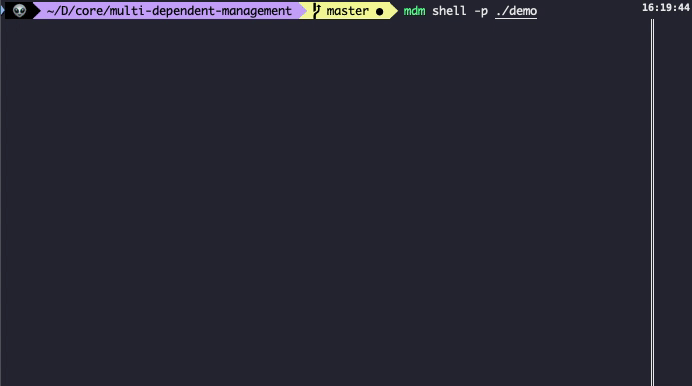
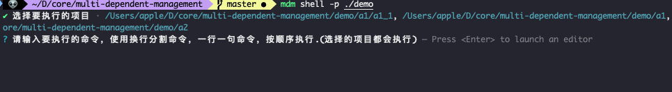
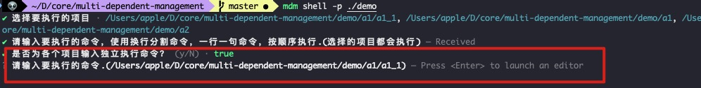
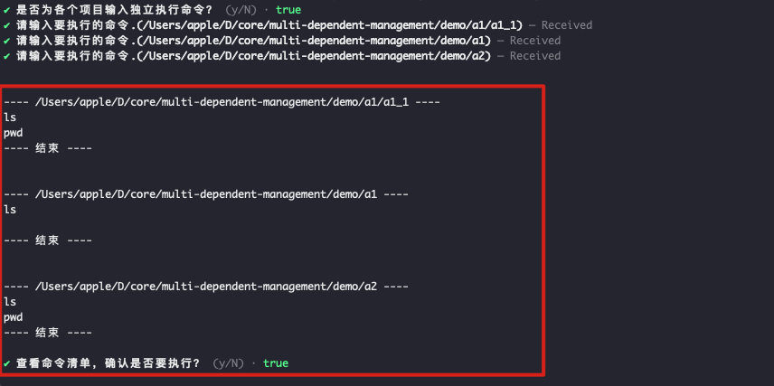
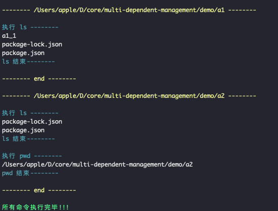
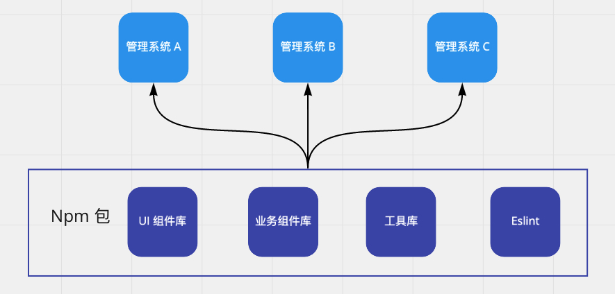
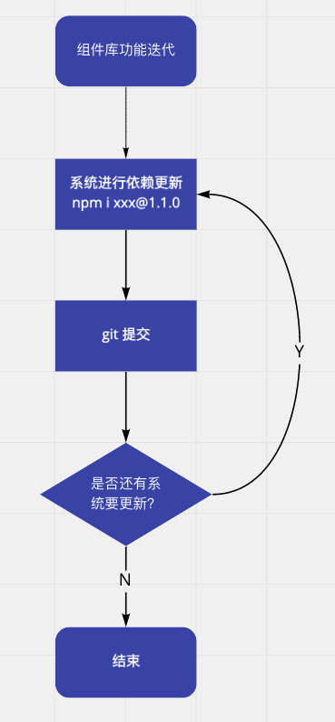

# multi-dependent-management

>基于 node.js 的命令行工具，用于管理多个项目的依赖。

   

## 概述

该工具是用于管理多个项目的依赖，根据你输入的路径，递归查询所有的 `package.json`（默认忽略 `node_modules` 文件），进行依赖管理：

1. 依赖批量版本升级（基于 [npm-check-updates](https://github.com/raineorshine/npm-check-updates)）
2. 依赖批量移除
3. 依赖批量添加/变更
4. 查看多项目内的依赖差异

## 安装

```shell
# 使用 npx 执行
npx multi-dependent-management
# 全局安装
npm i multi-dependent-management -g

```


## 快速使用

### 依赖版本升级

该功能根据你选中的项目，进行批量依赖升级。

```shell
# -p 后面带你要执行的项目路径
mdm upgrade -p ./project
```


首先会递归查询该路径下所有的 `package.json` 文件，然后使用 [npm-check-updates](https://github.com/raineorshine/npm-check-updates) 检查每个项目的依赖版本是否最新，将可以更新的依赖一一展现出来，让你选择哪个依赖需要更新：


当你确定升级后，这个工具只会帮你修改 `package.json` 的配置，不会执行 `npm i ` 去安装依赖。


### 依赖移除

该功能根据你选中的项目，进行批量依赖移除。

```shell
# -p 后面带你要执行的项目路径
mdm remove -p ./project
```


首先会让你输入要移除的依赖，使用 `,` 分隔每个依赖名。

接着会递归查询该路径下所有的 `package.json` 文件，让你选择哪个项目需要移除依赖。


### 依赖添加/变更

该功能根据你选中的项目，进行批量依赖添加或变更。

```shell
# -p 后面带你要执行的项目路径
mdm update -p ./project
```


首先会让你输入要更新的依赖，使用 `,` 分隔每个依赖名。

接着会让你选择是否安装依赖:


如果选择“是”，则会执行 `npm install {package}`，

否则执行：`npm install {package} --package-lock-only`，

最后会递归查询该路径下所有的 `package.json` 文件，让你选择哪个项目需要更新依赖。

变更操作，会使用 `npm install` 进行依赖变更，而不是直接修改 `package.json` 文件，保证包名的顺序一致。

### 查看依赖差异

该功能查看你选中项目的依赖差异。

```shell
# -p 后面带你要执行的项目路径
mdm diff -p ./project
```


`diff` 功能，会根据你选中的项目的依赖版本，返回需要升级的依赖和对应最高的版本。当你选择更新，会修改所有匹配的依赖变为当前最高的版本。

简单来说，就是同步你选中项目所有依赖的版本，变成一样。

`diff` 的更新操作，是直接修改 `package.json`，不会进行依赖安装。


### 脚本命令执行

该功能根据你选择的项目，批量执行脚本命令。

```shell
# -p 后面带你要执行的项目路径
mdm shell -p ./project
```



`shell` 功能，会根据你选中的项目，执行相关的脚本命令，该功能自由度比较高，可以搭配不同的操作。

选完要处理的项目后，会让你先输入都执行的命令，没有的话，不输入保存就行了：



接着就是输入每个项目单独执行的命令：



最后会让你确认是否按照上面的顺序执行：



执行结果：




### 路径匹配

```shell
# 过滤 /demo/a/ 下的所有文件夹 和所有子路径中末位是 b 的文件夹
mdm update -p /demo -e /demo/a/**,**/b
```

`-p` 参数是从哪个路径开始递归查询，`-e` 参数是对路径进行过滤，支持传入多个值，用 `,` 隔开。

我这里的处理，是将传给 `-e` 的值，转成数组并去空格处理，然后 `minimatch(path, {value})` 进行判断，如果返回 `true` 代表命中，则过滤该路径。

详细匹配规则，参考 [minimatch](https://github.com/isaacs/minimatch)。

## 应用场景

我现在日常开发，因为人少系统多，经常是一两个前端去管理多个简单的管理系统，而这些系统都使用内部的组件库进行搭建：



如果当我们的组件库有 bug 或者有功能迭代，要多个系统同时去发布修复版，这时候就有下面的流程：



有 10  个系统，就要进行 10 次这样的操作，非常麻烦，所以才开发该工具。

使用该工具，只需通过一次或两次命令就可以完成。

两次命令：

```shell
# 去到对面的目录，添加相关的过滤条件
mdm upgrade -p ./project -e **/abc,**/abc2
# 升级完需要的依赖后，执行相关提交命令
mdm shell -p ./project -e **/abc,**/abc2
# shell 模式会进行编辑状态，输入：
# git add ./
# git commit -m 'fix: 更新依赖，修复 xx 问题'
# git push origin fix
```

当执行完上述步骤，对应的项目就会更新选中的依赖，并根据你输入的 `shell` 命令，提交到你的仓库。

一次命令：

```shell
# 可以直接通过 shell 命令，一次完成
mdm shell -p ./project -e **/abc,**/abc2
# shell 模式会进行编辑状态，输入：
# npm i abc@1.1.0 -S
# git add ./
# git commit -m 'fix: 更新依赖，修复 xx 问题'
# git push origin fix
```


## TODO

1. ~~添加操作命令的配置项，比如文件匹配限制~~
2. ~~添加命令行操作，可以对项目批量执行 shell 命令~~
3. ~~添加依赖差异查看命令，查询匹配的项目，查看项目内每个依赖和当前最高版本的差异~~
