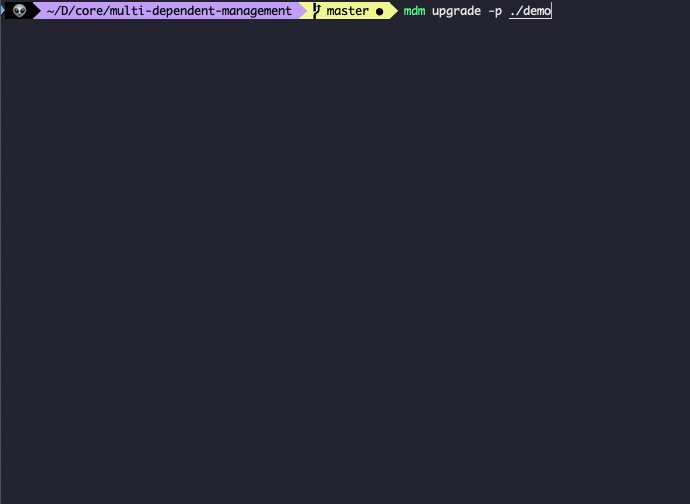

# multi-dependent-management

>基于 node.js 的命令行工具，用于管理多个项目的依赖。


## 概述

该工具是用于管理多个项目的依赖，根据你输入的路径，递归查询所有的 `package.json`（忽略 `node_modules` 文件），进行依赖管理：

1. 依赖版本升级（基于 [npm-check-updates](https://github.com/raineorshine/npm-check-updates)）
2. 依赖移除
3. 依赖添加/变更


## 安装

```shell
# 使用 npx 执行
npx multi-dependent-management
# 全局安装
npm i multi-dependent-management -g

```


## 快速使用

### 依赖版本升级

```shell
# -p 后面带你要执行的项目路径
mdm upgrade -p ./project
```



首先会递归查询该路径下所有的 `package.json` 文件，然后使用 [npm-check-updates](https://github.com/raineorshine/npm-check-updates) 检查每个项目的依赖版本是否最新，将可以更新的依赖一一展现出来，让你选择哪个依赖需要更新：


当你确定升级后，这个工具只会帮你修改 `package.json` 的配置，不会执行 `npm i ` 去安装依赖。


### 依赖移除

```shell
# -p 后面带你要执行的项目路径
mdm remove -p ./project
```


首先会让你输入要移除的依赖，使用 `,` 分隔每个依赖名。

接着会递归查询该路径下所有的 `package.json` 文件，让你选择哪个项目需要移除依赖。


### 依赖添加/变更

```shell
# -p 后面带你要执行的项目路径
mdm update -p ./project
```


首先会让你输入要更新的依赖，使用 `,` 分隔每个依赖名。

接着会让你选择是否安装依赖:


如果选择“是”，则会执行 `npm install {package}`，

否则执行：`npm install {package} --package-lock-only`，

最后会递归查询该路径下所有的 `package.json` 文件，让你选择哪个项目需要更新依赖。

变更操作，会使用 `npm install` 进行依赖变更，而不是直接修改 `package.json` 文件，保证包名的顺序一致。

### 查看依赖差异

```shell
# -p 后面带你要执行的项目路径
mdm diff -p ./project
```


`diff` 功能，会根据你选中的项目的依赖版本，返回需要升级的依赖和对应最高的版本。当你选择更新，会修改所有匹配的依赖变为当前最高的版本。

简单来说，就是同步你选中项目所有依赖的版本，变成一样。

`diff` 的更新操作，是直接修改 `package.json`，不会进行依赖安装。


### 路径匹配

```shell
# 过滤 /demo/a/ 下的所有文件夹 和所有子路径中末位是 b 的文件夹
mdm update -p /demo -e /demo/a/**,**/b
```

`-p` 参数是从哪个路径开始递归查询，`-e` 参数是对路径进行过滤，支持传入多个值，用 `,` 隔开。

我这里的处理，是将传给 `-e` 的值，转成数组并去空格处理，然后 `minimatch(path, {value})` 进行判断，如果返回 `true` 代表命中，则过滤该路径。

详细匹配规则，参考 [minimatch](https://github.com/isaacs/minimatch)。

## 应用场景

要开发这个工具的原因是因为在日程开发中，有大量类似的业务管理系统，这些系统都使用内部的组件库进行搭建的：


目前大概有 20 多个这样的系统，分别使用了不同的公共库。如果公共库出现了问题或者有新的功能迭代，系统的更新操作就很麻烦，需要一个个项目执行更新命令，所以我开发了这个工具，对多个项目快速进行依赖变更。

## TODO

1. ~~添加操作命令的配置项，比如文件匹配限制~~
2. ~~添加命令行操作，可以对项目批量执行 shell 命令~~
3. ~~添加依赖差异查看命令，查询匹配的项目，查看项目内每个依赖和当前最高版本的差异~~
4. 添加依赖移动，可以将项目的 dependencies 和 devDependencies 的依赖位置进行移动
5. 添加接口文档，可以在代码使用该库
